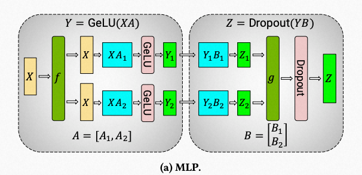
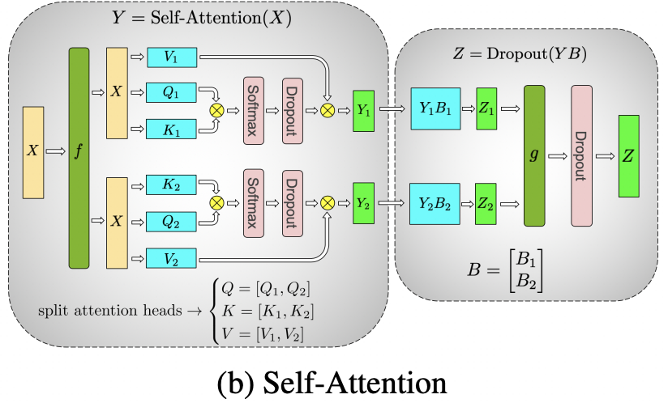

<div align='center'><font size='20'> transformer </font></div>

- megatron/model/transformer.py

# ParallelMLP
- [`ColumnParallelLinear`](../core/tensor_parallel/layers.md#columnparallellinear) projects hidden_size into 4*hidden_size
- activation
- [`RowParallelLinear`](../core/tensor_parallel/layers.md#rowparallellinear) projects 4*hidden_size back to hidden_size
- `ColumnParallelLinear` will not all_gather its output, and `RowParallelLinear` will take partitioned input


# CoreAttention
- Mostly the same as no tensor parallel
- Only adopt norm_factor and rng for tensor parallel
## forward
- View q into [b * np, sq, hn] and k into [b * np, hn, sk]
- baddbmm q and k and view output into [b, np, sq, sk] (attention_scores)
- FusedScaleMaskSoftmax attention_scores (attention_probs)
- Dropout on attention_probs
- View v into [b * np, sk, hn] and attention_probs into [b * np, sq, sk]
- bmm v and attention_probs (context)
- View context into [sq, b, hp]

# FlashSelfAttention
## forward
- View k, q and v to fit `flash_attn_unpadded_func`
- View output of `flash_attn_unpadded_func` into [b, sq, hp]

# ParallelAttention

## _checkpointed_attention_forward

## initialization
- [`ColumnParallelLinear`](../core/tensor_parallel/layers.md#columnparallellinear)
- [`RowParallelLinear`](../core/tensor_parallel/layers.md#rowparallellinear)
- [`CoreAttention`](#coreattention) or [`FlashSelfAttention`](#flashselfattention)
    <details> 
        <summary>Code for ParallelAttention.__init__</summary>  

    ```Python
    def __init__(self, init_method,
                 output_layer_init_method, layer_number,
                 attention_type=AttnType.self_attn,
                 attn_mask_type=AttnMaskType.padding):
        super(ParallelAttention, self).__init__()
        args = get_args()
        self.layer_number = max(1, layer_number)
        self.attention_type = attention_type
        self.attn_mask_type = attn_mask_type
        self.params_dtype = args.params_dtype
        self.sequence_parallel = args.sequence_parallel

        self.use_flash_attn = args.use_flash_attn
        if self.use_flash_attn:
            if flash_attn_unpadded_func is None:
                raise ImportError('FlashAttention is not installed, please install with '
                                  'pip install flash-attn')
            assert attention_type == AttnType.self_attn, ('FlashAttention code path only supports '
                                                          'self-attention for now')
            assert self.attn_mask_type == AttnMaskType.causal, ('FlashAttention code path only '
                                                                'supports causal mask for now')
            if rearrange is None:
                raise ImportError('einops is not installed, please install with pip install einops')

        projection_size = args.kv_channels * args.num_attention_heads

        # Per attention head and per partition values.
        world_size = mpu.get_tensor_model_parallel_world_size()
        self.hidden_size_per_attention_head = core.utils.divide(
            projection_size, args.num_attention_heads)
        self.num_attention_heads_per_partition = core.utils.divide(
            args.num_attention_heads, world_size)

        # Strided linear layer.
        if attention_type == AttnType.self_attn:
            self.query_key_value = tensor_parallel.ColumnParallelLinear(
                args.hidden_size,
                3 * projection_size,
                bias=args.add_bias_linear,
                gather_output=False,
                init_method=init_method,
                async_tensor_model_parallel_allreduce=args.async_tensor_model_parallel_allreduce,
                **_args_to_kwargs())
        else:
            assert attention_type == AttnType.cross_attn
            self.query = tensor_parallel.ColumnParallelLinear(
                args.hidden_size,
                projection_size,
                bias=args.add_bias_linear,
                gather_output=False,
                init_method=init_method,
                async_tensor_model_parallel_allreduce=args.async_tensor_model_parallel_allreduce,
                **_args_to_kwargs())


            self.key_value = tensor_parallel.ColumnParallelLinear(
                args.hidden_size,
                2 * projection_size,
                bias=args.add_bias_linear,
                gather_output=False,
                init_method=init_method,
                async_tensor_model_parallel_allreduce=args.async_tensor_model_parallel_allreduce,
                **_args_to_kwargs())

        self.core_attention = CoreAttention(self.layer_number,
                                            self.attn_mask_type)
        self.checkpoint_core_attention = args.recompute_granularity == 'selective'

        if self.use_flash_attn:
            self.core_attention_flash = FlashSelfAttention(
                causal=True, attention_dropout=args.attention_dropout
            )

        # Output.
        self.dense = tensor_parallel.RowParallelLinear(
            projection_size,
            args.hidden_size,
            bias=args.add_bias_linear,
            input_is_parallel=True,
            init_method=output_layer_init_method,
            skip_bias_add=True,
            **_args_to_kwargs())

    ```
    </details>
## forward
### Project hidden_states into k, q and v
- If self attention
  - [`ColumnParallelLinear`](../core/tensor_parallel/layers.md#columnparallellinear) projects hidden_state from hidden_size into 3*hidden_size (q, k, v in one linear)
- If cross attention
  - [`ColumnParallelLinear`](../core/tensor_parallel/layers.md#columnparallellinear) projects encoder_output from hidden_size into 2*hidden_size (k, v)
  - [`ColumnParallelLinear`](../core/tensor_parallel/layers.md#columnparallellinear) projects hidden_state from hidden_size into hidden_size (q)
- The `ColumnParallelLinear` will not all_gather its output, so that, q, k and v is split by attention heads. Reshape output of `ColumnParallelLinear` to obtain q, k and v
### Position embedding
### attention
- If not use_flash_attn
  - [`CoreAttention`](#coreattention) or [`_checkpointed_attention_forward`](#_checkpointed_attention_forward)
- If use_flash_attn
  - [`FlashSelfAttention`](#flashselfattention)
### Project context back into hidden_states
- [`RowParallelLinear`](../core/tensor_parallel/layers.md#rowparallellinear) all_gather distributed hidden_states
    <details> 
        <summary>Code for ParallelAttention.forward</summary>  

    ```Python
    def forward(self, hidden_states, attention_mask,
                encoder_output=None, inference_params=None,
                rotary_pos_emb=None):
        # hidden_states: [sq, b, h]

        # =================================================
        # Pre-allocate memory for key-values for inference.
        # =================================================
        is_first_step = False
        if inference_params:
            if self.layer_number not in inference_params.key_value_memory_dict:
                inf_max_seq_len = inference_params.max_sequence_len
                inf_max_batch_size = inference_params.max_batch_size
                inference_key_memory = self._allocate_memory(
                    inf_max_seq_len, inf_max_batch_size)
                inference_value_memory = self._allocate_memory(
                    inf_max_seq_len, inf_max_batch_size)
                inference_params.key_value_memory_dict[self.layer_number] = (
                    inference_key_memory, inference_value_memory)
                is_first_step = True
            else:
                inference_key_memory, inference_value_memory = \
                    inference_params.key_value_memory_dict[self.layer_number]

        # =====================
        # Query, Key, and Value
        # =====================

        if self.attention_type == AttnType.self_attn:
            # Attention heads [sq, b, h] --> [sq, b, (np * 3 * hn)]
            mixed_x_layer, _ = self.query_key_value(hidden_states)

            # [sq, b, (np * 3 * hn)] --> [sq, b, np, 3 * hn]
            new_tensor_shape = mixed_x_layer.size()[:-1] + \
                (self.num_attention_heads_per_partition,
                 3 * self.hidden_size_per_attention_head)
            mixed_x_layer = mixed_x_layer.view(*new_tensor_shape)

            # [sq, b, np, 3 * hn] --> 3 [sq, b, np, hn]
            (query_layer,
             key_layer,
             value_layer) = tensor_parallel.split_tensor_along_last_dim(mixed_x_layer, 3)
        else:
            # Attention heads [sk, b, h] --> [sk, b, (np * 2 * hn)]
            mixed_kv_layer, _ = self.key_value(encoder_output)

            # [sk, b, (np * 2 * hn)] --> [sk, b, np, 2 * hn]
            new_tensor_shape = mixed_kv_layer.size()[:-1] + \
                (self.num_attention_heads_per_partition,
                 2 * self.hidden_size_per_attention_head)
            mixed_kv_layer = mixed_kv_layer.view(*new_tensor_shape)

            # [sk, b, np, 2 * hn] --> 2 [sk, b, np, hn]
            (key_layer,
             value_layer) = tensor_parallel.split_tensor_along_last_dim(mixed_kv_layer, 2)

            # Attention head [sq, b, h] --> [sq, b, hp]
            query_layer, _ = self.query(hidden_states)
            # [sq, b, hp] --> [sq, b, np, hn]
            new_tensor_shape = query_layer.size()[:-1] + \
                (self.num_attention_heads_per_partition,
                 self.hidden_size_per_attention_head)
            query_layer = query_layer.view(*new_tensor_shape)

        # ==================================
        # Adjust key and value for inference
        # ==================================

        # duplicate the pos_emb for self attention
        if rotary_pos_emb is not None:
            if isinstance(rotary_pos_emb, tuple):
                rotary_pos_emb = rotary_pos_emb
            else:
                rotary_pos_emb = ((rotary_pos_emb,) * 2)

        if inference_params:
            batch_start = inference_params.batch_size_offset
            batch_end = batch_start + key_layer.size(1)
            assert batch_end <= inference_key_memory.size(1)
            sequence_start = inference_params.sequence_len_offset
            sequence_end = sequence_start + key_layer.size(0)
            assert sequence_end <= inference_key_memory.size(0)
            # Copy key and values.
            inference_key_memory[sequence_start:sequence_end,
                                 batch_start:batch_end, ...] = key_layer
            inference_value_memory[sequence_start:sequence_end,
                                   batch_start:batch_end, ...] = value_layer
            key_layer = inference_key_memory[
                :sequence_end, batch_start:batch_end, ...]
            value_layer = inference_value_memory[
                :sequence_end, batch_start:batch_end, ...]


            # adjust the key rotary positional embedding
            if rotary_pos_emb is not None:
                q_pos_emb, k_pos_emb = rotary_pos_emb
                # need to cross check this condition during inference
                # if not set_inference_key_value_memory:
                if not is_first_step:
                    # In inference, we compute one token at a time.
                    # Select the correct positional embedding
                    # (only the last token in the sequence)
                    q_pos_emb = q_pos_emb[sequence_end - 1 : sequence_end]
                else:
                    # In the first forward pass of inference,
                    # we use the entire provided prefix.
                    # q_pos_emb here has the rope embeddings of the entire
                    # prefix + to-be-generated output so
                    # we slice to just the prefix.
                    q_pos_emb = q_pos_emb[:sequence_end, :, :, :]
                k_pos_emb = k_pos_emb[:sequence_end, :, :, :]
                rotary_pos_emb = (q_pos_emb, k_pos_emb)


        # ==================================
        # core attention computation
        # ==================================

        # apply relative positional encoding (rotary embedding)
        if rotary_pos_emb is not None:
            q_pos_emb, k_pos_emb = rotary_pos_emb
            query_layer = apply_rotary_pos_emb(query_layer, q_pos_emb)
            key_layer = apply_rotary_pos_emb(key_layer, k_pos_emb)
            # TODO, can apply positional embedding to value_layer so it has
            # absolute positional embedding.
            # otherwise, only relative positional embedding takes effect
            # value_layer = apply_rotary_pos_emb(value_layer, k_pos_emb)

        if not self.use_flash_attn:
            if self.checkpoint_core_attention:
                context_layer = self._checkpointed_attention_forward(
                    query_layer, key_layer, value_layer, attention_mask)
            else:
                context_layer = self.core_attention(
                    query_layer, key_layer, value_layer, attention_mask)
        else:
            q, k, v = [rearrange(x, 's b ... -> b s ...').contiguous()
                       for x in (query_layer, key_layer, value_layer)]
            if not self.sequence_parallel:
                with tensor_parallel.get_cuda_rng_tracker().fork():
                    context_layer = self.core_attention_flash(q, k, v)
            else:
                context_layer = self.core_attention_flash(q, k, v)
            context_layer = rearrange(context_layer, 'b s h d -> s b (h d)').contiguous()

        # =================
        # Output. [sq, b, h]
        # =================

        output, bias = self.dense(context_layer)

        return output, bias

    ```
    </details>

# ParallelTransformerLayer
## initialization
- Input layernorm
- [`ParallelAttention`](#parallelattention)(self attention)
- Dropout
- Post attention layernorm
- If decoder
  - [`ParallelAttention`](#parallelattention)(cross attention)
  - Post inter attention layernorm
- If MOE
  - `SwitchMLP`
- Else
  - [`ParallelMLP`](#parallelmlp)
  <details> 
      <summary>Code for ParallelTransformerLayer.__init__</summary>  

  ```Python
  def __init__(self, init_method, output_layer_init_method,
                  layer_number, layer_type=LayerType.encoder,
                  self_attn_mask_type=AttnMaskType.padding,
                  drop_path_rate=0.):
      args = get_args()

      super(ParallelTransformerLayer, self).__init__()
      self.layer_number = layer_number
      self.layer_type = layer_type

      self.apply_residual_connection_post_layernorm \
          = args.apply_residual_connection_post_layernorm

      self.bf16 = args.bf16
      self.fp32_residual_connection = args.fp32_residual_connection

      # Layernorm on the input data.
      self.input_layernorm = LayerNorm(
          args.hidden_size,
          eps=args.layernorm_epsilon,
          no_persist_layer_norm=args.no_persist_layer_norm,
          sequence_parallel=args.sequence_parallel,
          apply_layernorm_1p=args.apply_layernorm_1p)

      # Self attention.
      self.self_attention = ParallelAttention(
          init_method,
          output_layer_init_method,
          layer_number,
          attention_type=AttnType.self_attn,
          attn_mask_type=self_attn_mask_type)
      self.hidden_dropout = args.hidden_dropout
      self.bias_dropout_fusion = args.bias_dropout_fusion
      self.drop_path = DropPath(drop_path_rate) if drop_path_rate > 0.0 else None

      # Layernorm on the attention output
      self.post_attention_layernorm = LayerNorm(
          args.hidden_size,
          eps=args.layernorm_epsilon,
          no_persist_layer_norm=args.no_persist_layer_norm,
          sequence_parallel=args.sequence_parallel,
          apply_layernorm_1p=args.apply_layernorm_1p)

      if self.layer_type == LayerType.decoder:
          self.inter_attention = ParallelAttention(
              init_method,
              output_layer_init_method,
              layer_number,
              attention_type=AttnType.cross_attn)
          # Layernorm on the attention output.
          self.post_inter_attention_layernorm = LayerNorm(
              args.hidden_size,
              eps=args.layernorm_epsilon,
              no_persist_layer_norm=args.no_persist_layer_norm,
              sequence_parallel=args.sequence_parallel,
              apply_layernorm_1p=args.apply_layernorm_1p)

      # MLP
      if args.num_experts is not None:
          self.mlp = SwitchMLP(init_method, output_layer_init_method)
      else:
          self.mlp = ParallelMLP(init_method, output_layer_init_method)

      # Set bias+dropout+add fusion grad_enable execution handler.
      TORCH_MAJOR = int(torch.__version__.split('.')[0])
      TORCH_MINOR = int(torch.__version__.split('.')[1])
      use_nvfuser = TORCH_MAJOR > 1 or (TORCH_MAJOR == 1 and TORCH_MINOR >= 10)
      self.bias_dropout_add_exec_handler = \
              nullcontext if use_nvfuser else torch.enable_grad
  ```
  </details>

## forward
- Input layernorm
- Self attention
- Dropout and add residual (hidden_states or layernormed hidden_states with self attention output)
- Post attention layernorm
- If decoder
  - Cross attention
  - Dropout and add residual (hidden_states or layernormed hidden_states with cross attention output)
- MLP
- Dropout and add residual (hidden_states or layernormed hidden_states with  MLP output)
  <details> 
      <summary>Code for ParallelTransformerLayer.forward</summary>  

  ```Python
  def forward(self, hidden_states, attention_mask,
              encoder_output=None, enc_dec_attn_mask=None,
              inference_params=None, rotary_pos_emb=None):
      # hidden_states: [s, b, h]

      # Layer norm at the beginning of the transformer layer.
      layernorm_output = self.input_layernorm(hidden_states)
      # Self attention.
      attention_output, attention_bias = \
          self.self_attention(
              layernorm_output,
              attention_mask,
              inference_params=inference_params,
              rotary_pos_emb=rotary_pos_emb)

      # Residual connection.
      if self.apply_residual_connection_post_layernorm:
          residual = layernorm_output
      else:
          residual = hidden_states

      if self.drop_path is None:
          # jit scripting for a nn.module (with dropout) is not
          # trigerring the fusion kernel. For now, we use two
          # different nn.functional routines to account for varying
          # dropout semantics during training and inference phases.
          if self.bias_dropout_fusion:
              if self.training:
                  bias_dropout_add_func = bias_dropout_add_fused_train
              else:
                  bias_dropout_add_func = bias_dropout_add_fused_inference
          else:
              bias_dropout_add_func = get_bias_dropout_add(self.training)

          if attention_bias is not None:
              attention_bias = attention_bias.expand_as(residual)
          with self.bias_dropout_add_exec_handler():
              layernorm_input = bias_dropout_add_func(
                  attention_output,
                  attention_bias,
                  residual,
                  self.hidden_dropout)
      else:
          out = torch.nn.functional.dropout(attention_output + attention_bias,
                                              p=self.hidden_dropout,
                                              training=self.training)
          layernorm_input = residual + self.drop_path(out)

      # Layer norm post the self attention.
      layernorm_output = self.post_attention_layernorm(layernorm_input)

      if self.layer_type == LayerType.decoder:
          attention_output, attention_bias = \
              self.inter_attention(layernorm_output,
                                      enc_dec_attn_mask,
                                      encoder_output=encoder_output)
          # residual connection
          if self.apply_residual_connection_post_layernorm:
              residual = layernorm_output
          else:
              residual = layernorm_input

          if attention_bias is not None:
              attention_bias = attention_bias.expand_as(residual)

          with self.bias_dropout_add_exec_handler():
              layernorm_input = bias_dropout_add_func(
                  attention_output,
                  attention_bias,
                  residual,
                  self.hidden_dropout)

          # Layer norm post the decoder attention
          layernorm_output = self.post_inter_attention_layernorm(layernorm_input)

      # MLP.
      mlp_output, mlp_bias = self.mlp(layernorm_output)

      # Second residual connection.
      if self.apply_residual_connection_post_layernorm:
          residual = layernorm_output
      else:
          residual = layernorm_input

      if self.drop_path is None:
          if mlp_bias is not None:
              mlp_bias = mlp_bias.expand_as(residual)
          with self.bias_dropout_add_exec_handler():
              output = bias_dropout_add_func(
                  mlp_output,
                  mlp_bias,
                  residual,
                  self.hidden_dropout)

          # Jit compiled function creates 'view' tensor. This tensor
          # potentially gets saved in the MPU checkpoint function context,
          # which rejects view tensors. While making a viewless tensor here
          # won't result in memory savings (like the data loader, or
          # p2p_communication), it serves to document the origin of this
          # 'view' tensor.
          output = core.utils.make_viewless_tensor(inp = output,
                                                      requires_grad = output.requires_grad,
                                                      keep_graph = True)

      else:
          if mlp_bias is not None:
              mlp_output = mlp_output + mlp_bias
          out = torch.nn.functional.dropout(mlp_output,
                                              p=self.hidden_dropout,
                                              training=self.training)
          output = residual + self.drop_path(out)

      return output
  ```
  </details>
