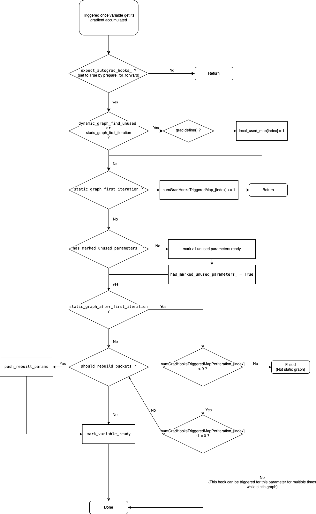

<div align='center'><font size='20'> Reducer </font></div>

`torch/csrc/distributed/c10d/reducer.cpp`

# compute_bucket_assignment_by_size

`torch/csrc/distributed/c10d/reducer.cpp`

- Return a tuple of two vectors, the first is tensors’ indices in the buckets, the second is the size limit of the buckets
- Tensors with sparse gradients would be in a bucket alone
- Sort the bucket according to the smallest index in it
  <details> 
      <summary>Code for compute_bucket_assignment_by_size</summary>  
    
    ```cpp
    std::tuple<std::vector<std::vector<size_t>>, std::vector<size_t>>
    compute_bucket_assignment_by_size(
        const std::vector<at::Tensor>& tensors,
        const std::vector<size_t>& bucket_size_limits,
        const std::vector<bool>& expect_sparse_gradient,
        const std::vector<int64_t>& tensor_indices,
        const c10::optional<std::weak_ptr<c10d::Logger>>& logger) {
      // Either expect_sparse_gradient is not specified or it has as many elements
      // as the vector with tensors.
      TORCH_INTERNAL_ASSERT(
          expect_sparse_gradient.empty() ||
          (tensors.size() == expect_sparse_gradient.size()));
      TORCH_INTERNAL_ASSERT(tensors.size() > 0);
      // Store bucket indices and their sizes together, because we later sort the
      // resulting indices by minimum tensor index and want to keep sizes
      // consistent.
      std::vector<std::tuple<std::vector<size_t>, size_t>> result;
      // Sparse tensors go in their own bucket, so they do not have an enforced size
      // limit.
      size_t kNoSizeLimit = 0;
      result.reserve(tensors.size());
    
      // Keep iterator into the size_limit vector by tensor type and device.
      // This is done so that we can use the consecutive bucket limits per type.
      std::unordered_map<
          BucketKey,
          std::vector<size_t>::const_iterator,
          c10::hash<BucketKey>>
          bucket_size_limit_iterators;
    
      // Keep vector of indices and size accumulator by tensor type and device.
      std::unordered_map<BucketKey, BucketAccumulator, c10::hash<BucketKey>>
          buckets;
    
      for (const auto i : c10::irange(tensors.size())) {
        const auto& tensor = tensors[i];
        auto msg = std::string("No support for sparse tensors.");
        if (logger.has_value()) {
          REDUCER_CHECK(!tensor.is_sparse(), logger.value(), msg);
        } else {
          TORCH_CHECK(!tensor.is_sparse(), msg);
        }
    
        // when tensor_indices is empty, the index of tensors[i] assigned to
        // bucket is i, otherwise the tensor index is tensor_indices[i].
        auto tensor_index = i;
        if (!tensor_indices.empty()) {
          tensor_index = tensor_indices[i];
        }
        // If we expect a sparse gradient to be produced for this tensor, it cannot
        // be grouped together with other gradients and gets its own bucket.
        if (!expect_sparse_gradient.empty() &&
            expect_sparse_gradient[tensor_index]) {
          result.emplace_back(std::vector<size_t>({tensor_index}), kNoSizeLimit);
          continue;
        }
    
        auto key = BucketKey(tensor.scalar_type(), tensor.device());
        auto& bucket = buckets[key];
        bucket.indices.push_back(tensor_index);
        bucket.size += tensor.numel() * tensor.element_size();
    
        // Initialize bucket size limit iterator if necessary.
        if (bucket_size_limit_iterators.count(key) == 0) {
          bucket_size_limit_iterators[key] = bucket_size_limits.begin();
        }
    
        auto& bucket_size_limit_iterator = bucket_size_limit_iterators[key];
        const auto bucket_size_limit = *bucket_size_limit_iterator;
        bucket.size_limit = bucket_size_limit;
        if (bucket.size >= bucket_size_limit) {
          result.emplace_back(std::move(bucket.indices), bucket.size_limit);
          bucket = BucketAccumulator();
    
          // Advance to the next bucket size limit for this type/device.
          auto next = bucket_size_limit_iterator + 1;
          if (next != bucket_size_limits.end()) {
            bucket_size_limit_iterator = next;
          }
        }
      }
    
      // Add remaining buckets.
      for (auto& it : buckets) {
        auto& bucket = it.second;
        if (!bucket.indices.empty()) {
          result.emplace_back(std::move(bucket.indices), bucket.size_limit);
        }
      }
    
      // If tensor_indices is not empty, the order of the tensors is in the gradient
      // ready order, so no need to sort.
      // If tensor_indices is empty, sort resulting buckets by the minimum tensor
      // index they include. We assume that the order of the tensors is the order in
      // which they are used (or the reverse order in which their gradients are
      // produced). This sorting step ensures that the buckets are ready in
      // consecutive order.
      if (tensor_indices.empty()) {
        std::sort(
            result.begin(),
            result.end(),
            [](const std::tuple<std::vector<size_t>, size_t>& a,
               const std::tuple<std::vector<size_t>, size_t>& b) {
              auto indices_a = std::get<0>(a);
              auto indices_b = std::get<0>(b);
              const auto amin =
                  std::min_element(indices_a.begin(), indices_a.end());
              const auto bmin =
                  std::min_element(indices_b.begin(), indices_b.end());
              return *amin < *bmin;
            });
      }
    
      // Return bucket indices and size limits as separate entries in tuple, as some
      // APIs only need to consume bucket indices.
      std::vector<std::vector<size_t>> bucket_indices;
      bucket_indices.reserve(result.size());
      std::vector<size_t> per_bucket_size_limits;
      per_bucket_size_limits.reserve(result.size());
      for (const auto& bucket_indices_with_size : result) {
        bucket_indices.emplace_back(std::get<0>(bucket_indices_with_size));
        per_bucket_size_limits.emplace_back(std::get<1>(bucket_indices_with_size));
      }
      return std::make_tuple(bucket_indices, per_bucket_size_limits);
    }
    ```
  </details> 
---

# Reducer
`torch/csrc/distributed/c10d/reducer.hpp`
- Register a post hook([`autograd_hook`](#reducerautogradhook)) to each parameter’s [`AccumulateGrad`](../Autograd/AccumulateGrad.md)
- Bucketing parameters’ grads
- Apply `comm_hook`(`all_reduce` by default) to each bucket’s grads once all [`autograd_hook`](#reducerautogradhook) are triggered
- Write reduced grads back to parameters

## Definition
* <details> 
      <summary>Code for Reducer</summary> 
    
    ```cpp
    class TORCH_API Reducer {
     public:
      // The constructor takes a list of variables (i.e. parameters) for this
      // process's single model replica (as DDP assumes single-process
      // single-device). The bucket assignment for this reducer, `bucket_indices`,
      // is specified as a list of buckets, each of which is specified as a list of
      // indices into the bucket's `variables` list.
      explicit Reducer(
          std::vector<at::Tensor> params,
          std::vector<std::vector<size_t>> bucket_indices,
          std::vector<size_t> per_bucket_size_limits,
          c10::intrusive_ptr<c10d::ProcessGroup> process_group,
          std::vector<bool> expect_sparse_gradients,
          int64_t bucket_bytes_cap,
          bool find_unused_parameters,
          bool gradient_as_bucket_view,
          std::unordered_map<size_t, std::string> param_names,
          int64_t first_bucket_bytes_cap);
    
      ~Reducer() noexcept(false);
    
      // To (re-)initialize bucket assignment, pass a list of buckets, each of
      // which is specified by a list of indices in the bucket's `variables` list.
      // This function performs validation that the variables within a bucket
      // all live on the same device and have the same dimensionality.
      void initialize_buckets(std::vector<std::vector<size_t>> bucket_indices);
    
      // This function is called when the forward function has produced an output,
      // and the user wishes to reduce gradients in the backwards pass.
      // If they don't, and wish to accumulate gradients before reducing them,
      // a call to this function can simply be omitted.
      void prepare_for_backward(const std::vector<at::Tensor>& outputs);
    
      // Called at the begginning of forward() inside DistributedDataParallel,
      // right now it caputures the starting time of forward in each iteration.
      void prepare_for_forward();
    
      // Returns the relative time in nanoseconds when gradients were ready,
      // with respect to the time `prepare_for_backward` was called. The
      // vector is for parameters for a single model replica.
      std::vector<int64_t> get_backward_stats() const {
        return backward_stats_;
      }
    
      // Registers a hook to the reducer. The hook is `CommHookInterface`
      // type to allow both Python and CPP hooks. This function can only
      // be called once before calling backward.
      // Cannot combine with the call of `register_builtin_comm_hook`.
      void register_comm_hook(std::unique_ptr<CommHookInterface> iface);
    
      // Registers a built-in C++ comm hook to the reducer. This function can only
      // be called once before calling backward.
      // Cannot combine with the call of `register_comm_hook`.
      void register_builtin_comm_hook(c10d::BuiltinCommHookType comm_hook_type);
    
      // Runs allreduce or installed communication hook given GradBucket instance.
      c10::intrusive_ptr<c10::ivalue::Future> run_comm_hook(
          GradBucket& grad_bucket);
    
      // Returns gradient buckets in sequential order of buckets_. This is the order
      // in which buckets are reduced across processes. If return_zero_tensors=true,
      // will return zero tensors of the same shape instead of the true tensors.
      std::vector<c10d::GradBucket> get_grad_buckets(
          bool return_zero_tensors = true) const;
    
      // Rebuild buckets based on rebuilt_params_ and rebuilt_param_indices_
      // according to when tensors received grads in the backward pass.
      // TODO this function makes broadcast communication call and
      // could be overlapped with next forward() call, thus
      // it could be async. Will make it async when rebuilding buckets for
      // find_unused_parameters = true case, as we could rebuild buckets more than
      // once for find_unused_parameters = true case, where subgraphs are trained
      // and parameter indices order may change more frequently.
      // For find_unused_parameters = false case, buckets are only rebuilt once,
      // the performance cost is negligible. Returns true if the buckets were
      // rebuilt.
      bool rebuild_buckets();
    
      // Install futures that should be awaited at end of backwards. Currently these
      // are only used by user-defined custom buffer reduction hooks, but can be generalized
      // to any user-originating futures that need to be awaited.
      void install_futures(c10::List<c10::intrusive_ptr<c10::ivalue::Future>> futs);
    
      // Returns true if we should rebuild buckets, else false. We only rebuild
      // buckets once after the first iteration and never rebuild them if
      // find_unused_parameters_.
      inline bool should_rebuild_buckets() const {
        return (static_graph_ || !find_unused_parameters_) && !has_rebuilt_bucket_;
      }
    
      // Pushes all parameters to be rebuilt.
      void push_rebuilt_params_for_all_indices();
    
      // Creates and sets ForwardPassWorkHandle given a ProcessGroup::Work and the
      // corresponding tensor being reduced.
      void set_forward_pass_work_handle(
          c10::intrusive_ptr<c10d::ProcessGroup::Work> forwardPassWorkHandle,
          bool useStaticWorldSize);
    
      // Retrieve on-device tensors used to track locally unused parameters. It is
      // a tensor where index i = 1 if the Variable with that index has been used.
      at::Tensor get_local_used_map_on_device() const;
    
      // An function for users to set sample_rate of collecting
      // runtime stats. The time stats will be recorded for the
      // first 10 iterations, after 10 iteratons time stats will be
      // recorded once every "sample_rate" training iterations.
      void set_ddp_runtime_logging_sample_rate(int sample_rate);
    
      // Specify the training graph is static.
      void set_static_graph();
    
      // Delay all reduce to be after all gradients' calculation is complete.
      void delay_all_reduce();
    
      // Weak reference to associated DDP logger. The reference is weak to avoid
      // refcycle between reducer and logger.
      void set_logger(std::weak_ptr<c10d::Logger> logger);
    
      // When graph is not explicitly set by user as static and has unused
      // parameters, this will return whether the graph has been static until the
      // current iteration, which means unused params set has not changed.
      bool ddp_graph_static();
    
     protected:
      // Forward declaration.
      struct Bucket;
    
      void push_rebuilt_params(const size_t& index);
    
      // NOLINTNEXTLINE(cppcoreguidelines-non-private-member-variables-in-classes)
      mutable std::mutex mutex_;
      // NOLINTNEXTLINE(cppcoreguidelines-non-private-member-variables-in-classes)
      const std::vector<at::Tensor> params_;
      // NOLINTNEXTLINE(cppcoreguidelines-non-private-member-variables-in-classes)
      const c10::intrusive_ptr<::c10d::ProcessGroup> process_group_;
      // NOLINTNEXTLINE(cppcoreguidelines-non-private-member-variables-in-classes)
      std::vector<bool> expect_sparse_gradients_;
    
      std::vector<std::shared_ptr<torch::autograd::Node>>
          grad_accumulators_; // NOLINT(cppcoreguidelines-non-private-member-variables-in-classes)
      // NOLINTNEXTLINE(cppcoreguidelines-non-private-member-variables-in-classes)
      std::unordered_map<torch::autograd::Node*, size_t> gradAccToVariableMap_;
      std::vector<std::pair<uintptr_t, std::shared_ptr<torch::autograd::Node>>>
          hooks_; // NOLINT(cppcoreguidelines-non-private-member-variables-in-classes)
    
      // NOLINTNEXTLINE(cppcoreguidelines-non-private-member-variables-in-classes)
      bool expect_autograd_hooks_;
      // NOLINTNEXTLINE(cppcoreguidelines-non-private-member-variables-in-classes)
      bool require_finalize_;
      // NOLINTNEXTLINE(cppcoreguidelines-non-private-member-variables-in-classes)
      size_t next_bucket_;
    
      // NOLINTNEXTLINE(cppcoreguidelines-non-private-member-variables-in-classes)
      bool has_marked_unused_parameters_;
      // NOLINTNEXTLINE(cppcoreguidelines-non-private-member-variables-in-classes)
      const bool find_unused_parameters_;
      // NOLINTNEXTLINE(cppcoreguidelines-non-private-member-variables-in-classes)
      const bool gradient_as_bucket_view_;
      // NOLINTNEXTLINE(cppcoreguidelines-non-private-member-variables-in-classes)
      std::vector<size_t> unused_parameters_;
      // Previous iteration's unused params, used for checking if unused parameters
      // change between iterations. Only filled during the first backwards call.
      // NOLINTNEXTLINE(cppcoreguidelines-non-private-member-variables-in-classes)
      std::vector<size_t> prev_iteration_unused_parameters_;
      // Whether graph is static or not. When user does not explicitly set static
      // graph, the only possible dynamism is set of unused parameters changing
      // between iterations which is tracked by this flag.
      // NOLINTNEXTLINE(cppcoreguidelines-non-private-member-variables-in-classes)
      bool ddp_graph_static_{true};
      // Locally used parameter maps indicating if parameters are used locally
      // during the current iteration or no_sync session if no_sync is on.
      // Each map is a one-dim int32 tensor of number of parameters. These tensors
      // are marked in autograd_hook to indicate the corresponding param has been
      // used, and get allreduced in the end of backward step of current iteration
      // or no_sync session for figuring out the globally unused parameters.
      //
      // local_used_map_:     CPU tensor for bookkeeping locally used params
      // local_used_map_dev_: dev tensor for reducing globally unused params
      at::Tensor local_used_map_;
      at::Tensor local_used_map_dev_;
      // Indicate that reduction is done and D2H copy is done as well.
      bool local_used_map_reduced_;
    
      // Weak pointer to associated DDP logger.
      std::weak_ptr<c10d::Logger> logger_;
      // List of futures installed by Reducer::install_futures that should be awaited
      // at the end of backwards pass.
      c10::optional<c10::List<c10::intrusive_ptr<c10::ivalue::Future>>> installed_futures_{c10::nullopt};
    
      // Work handle for allreduce on local_used_map_
      c10::intrusive_ptr<c10d::ProcessGroup::Work> local_used_work_;
    
      void mark_variable_ready_dense(size_t variable_index);
    
      void mark_variable_ready_sparse(size_t variable_index);
    
      void mark_variable_ready(size_t variable_index);
    
      void autograd_hook(size_t index);
    
      void mark_bucket_ready(size_t bucket_index);
    
      void finalize_bucket_dense(Bucket& bucket);
    
      void finalize_backward();
    
      // Returns list of model parameters corresponding to the given bucket.
      // bucket_index is a key to cache after buckets are rebuilt, after which this
      // mapping never changes.
      std::vector<at::Tensor> get_variables_for_bucket(
          size_t bucket_index, const Bucket& bucket) const;
    
      // Asserts that the reduction for the previous iteration has finished before
      // rebuilding buckets or kicking off the next one.
      void ensure_prior_reduction_finished();
    
      // Broadcast rebuilt buckets from rank 0 to other ranks before initializing
      // the buckets
      void sync_bucket_indices(std::vector<std::vector<size_t>>& bucket_indices);
    
      // We'd like to use DistAutogradContext::GradCallback here but dist autograd
      // doesn't exist under Windows. So we just directly use the concrete type but
      // to preserve and enforce our original intent we do a static assert when dist
      // autograd is available.
      using GradCallback = std::function<bool(at::Tensor&)>;
    #ifndef _WIN32
      static_assert(
          std::is_same<
              GradCallback,
              torch::distributed::autograd::DistAutogradContext::GradCallback>::
              value,
          "");
    #endif
      void runGradCallbackForVariable(at::Tensor& variable, GradCallback&& cb);
    
      // This function is called inside `initialize_buckets()`. It initializes both
      // `bucket_views_in` and `bucket_views_out` with views for each variable's
      // gradient into the bucket's flattened `gradients` tensor. Views serve as
      // entry points to `copy_()` each grad's data in/out of the flattened
      // `gradients` tensor.
      void initialize_bucket_views(Bucket& bucket);
    
      // This function is called inside `finalize_backward`, it happens only if
      // DDP communication hook was registered to recreate just bucket_views_out
      // with the result of `future_work`.
      void populate_bucket_views_out(Bucket& bucket, at::Tensor& tensor);
    
      // If gradient_as_bucket_view_ is false, after allreduce buckets,
      // copy bucket results back to grads.
      void copy_bucket_to_grad(
          at::Tensor& variable,
          Reducer::Bucket& bucket,
          size_t intra_bucket_index,
          bool global_unused);
      // Check layout of grad and bucket_view before copying the grad to bucket.
      void check_grad_layout(const at::Tensor& grad, const at::Tensor& bucket_view);
    
      // A bucket contains [1..N] gradients to be reduced, where the gradients
      // have the same dtype and device.
      // Coalescing gradients together before reducing can result in lower overhead
      // and/or faster time to completion. Coalescing requires the constituent
      // gradients to have the same dtype and device, and the resulting flattened
      // tensor uses that common dtype and device. The flattened tensor is filled
      // as the corresponding gradients are computed (triggered by autograd hooks),
      // and the buckets are reduced in a predetermined order consistent across
      // processes.
      struct Bucket {
        // Gradients of the bucket flattened into a 1-dimensional tensor
        at::Tensor gradients;
    
        // Views into the `gradients` tensor for each individual gradient
        // Each view is created with layout (size and stride) matching the
        // gradient's expected layout (see the "Gradient Layout Contract" in
        // torch/csrc/autograd/functions/accumulate_grad.h).
        // `bucket_views_in[i].copy_(grad)` and `grad.copy_(bucket_views_out[i])`
        // provide convenient ways to copy gradient data in/out of `gradients`,
        // respectively.
        // We keep both `bucket_views_in` and `bucket_views_out` because
        // registering a DDP communication hook may re-initialize
        // `bucket_views_out` with the value of the hook's `future_work` but we
        // still need separate views into the bucket's original flattened gradient
        // to copy in gradient data.
        std::vector<at::Tensor> bucket_views_in;
        std::vector<at::Tensor> bucket_views_out;
    
        // Variables whose gradients are held in this bucket
        // We use refcounted tensors here so that we can easily unflatten the
        // bucket's flattened `gradients` tensor into the participating variables
        // after reduction has completed.
        std::vector<at::Tensor> variables;
    
        // Per-variable offset/length into the flattened `gradients` tensor and
        // the corresponding `GradBucket` instance for communication hooks
        std::vector<size_t> offsets;
        std::vector<size_t> lengths;
    
        // Per-variable sizes slicing into the bucket's `gradients` tensor
        std::vector<c10::IntArrayRef> sizes_vec;
    
        // Number of gradients left to be computed before the bucket is ready to
        // be reduced
        size_t pending;
    
        // Global indices of participating variables in the bucket
        std::vector<size_t> variable_indices;
    
        // Future work handle for DDP communication hook
        // If no hook is registered, a temporary vanilla allreduce hook is used.
        c10::intrusive_ptr<at::ivalue::Future> future_work;
    
        // If this bucket should expect a single sparse gradient
        // If `true`, then this implies that `bucket.variables.size() == 1`.
        bool expect_sparse_gradient = false;
    
        // TODO(@pietern)
        // Memory copies from gradient tensors into the bucket are potentially
        // done on different CUDA streams. We record an event for every copy
        // so that we can synchronize with them prior to kicking off the reduction.
        // std::vector<at::cuda::CUDAEvent> events;
    
      };
    
      std::vector<Bucket> buckets_;
    
      // A variable locator locates a particular variable in the reducer's buckets
      struct VariableLocator {
        // Index of the bucket containing the variable in the `buckets_` vector
        size_t bucket_index;
        // Index of the variable in the bucket, which may be used consistently
        // across `bucket_views_in`, `bucket_views_out`, `variables`, `offsets`,
        // `lengths`, `sizes_vec`, and `variable_indices` in `Bucket`
        size_t intra_bucket_index;
    
        VariableLocator() = default;
    
        VariableLocator(size_t bucket_index_, size_t intra_bucket_index_) {
          bucket_index = bucket_index_;
          intra_bucket_index = intra_bucket_index_;
        }
      };
    
      // Map the index of a variable to its location in the bucket structure.
      std::vector<VariableLocator> variable_locators_;
    
      // track the number of iterations to synchronize grads in training so far.
      long num_iterations_;
      // track the number of buckets that have been ready for
      // communication calls like allReduce or communication hooks.
      int num_buckets_ready_;
    
      // Timing information.
      int64_t backward_compute_start_time_ = -1;
      std::unique_ptr<Timer> timer_;
    
      // We collect the relative timestamp of every gradient being ready
      // when executing autograd. This can be used to derive a timeline of
      // the point in time buckets were ready, or ideal bucket assignment/ordering.
      std::vector<int64_t> backward_stats_;
    
      bool should_collect_runtime_stats();
      void record_forward_compute_start_time();
      void record_backward_compute_start_time();
      void record_backward_compute_end_time();
      void record_backward_comm_start_time();
      void record_backward_comm_end_time();
    
      int get_ddp_runtime_logging_sample_rate();
      int ddp_runtime_logging_sample_rate_ = kDDPRuntimeLoggingSampleRate;
    
      bool is_multi_device_module_ = false;
    
      // Following variables are to help build dynamic bucket order
      bool has_rebuilt_bucket_;
      std::vector<at::Tensor> rebuilt_params_;
      std::vector<int64_t> rebuilt_param_indices_;
      const int64_t bucket_bytes_cap_;
    
    #ifndef _WIN32
      struct RpcContext {
        using ContextPtr = torch::distributed::autograd::ContextPtr;
        // The shared_ptr is to hold the context instance.
        ContextPtr context_ptr_holder;
        std::atomic<ContextPtr::element_type*> context_ptr{nullptr};
    
        void set(ContextPtr&& new_context_ptr);
      };
      RpcContext rpc_context_;
    #endif
    
      // A struct containing work handle and tensor for allreduce scheduled in
      // forward pass, if applicable.
      struct ForwardPassAllreduceWork {
        c10::intrusive_ptr<c10d::ProcessGroup::Work> workHandle;
        at::Tensor resultTensor;
        // whether we should divide by the initial world_size or the no. of
        // remaining DDP ranks.
        bool useStaticWorldSize;
      };
    
      // Handle for the currently scheduled allreduce in the forward pass, if
      // applicable.
      ForwardPassAllreduceWork forwardPassWorkHandle_;
    
      // Division factor for reduction of gradients.
      // Equal to the process group size, with an exception of handling uneven
      // input.
      int div_factor_;
    
      bool static_graph_;
    
      // Key: size_t (index), Value: the number of times that a variable's
      // autograd_hook() should be triggered before marking this variable's grad as
      // ready for communication. Map will not change after 1st iteration.
      std::unordered_map<size_t, int> numGradHooksTriggeredMap_;
      // Key: size_t (index), Value: the number of times that a variable's
      // autograd_hook() are left to be triggered before marking this variable's
      // grad as ready for communication. Map will change after 1st iteration to
      // track a grad is ready for communication or not.
      std::unordered_map<size_t, int> numGradHooksTriggeredMapPerIteration_;
    
     private:
      // reset counting for buckets before backward starts
      void reset_bucket_counting();
      // search unused parameters beore backward starts
      void search_unused_parameters(
          const std::vector<torch::autograd::Variable>& outputs);
      void set_divide_factor();
      // kick off all reduce for the ready bucket
      void all_reduce_bucket(Bucket& bucket);
      // kick off all reduce to local used map, it can help find global unused
      // parameters
      void all_reduce_local_used_map();
      // initialize locally used parameter maps
      void initialize_local_used_map();
      // get current cuda stream
      const c10::Stream get_current_stream();
      bool dynamic_graph_find_unused();
      bool static_graph_first_iteration();
      bool static_graph_after_first_iteration();
    
      // comm_hook_ is used to access the DDP communication hook if registered.
      std::unique_ptr<CommHookInterface> comm_hook_;
      // Debug level setting. It is parsed once when Reducer is constructed, and
      // remains the same across a single invocation of DDP training.
      DebugLevel ddp_debug_level_;
      // Mapping of variable index to fully qualified name of model to notify users
      // about errors when certain parameters do not get gradient.
      std::unordered_map<size_t, std::string> param_names_;
      // Variable indices stored sequentially in order of when the gradient is ready
      // for the current backwards pass.
      std::vector<int> grad_ready_order_indices_;
      // Bytes capacity of first bucket, can be configured by user
      int64_t first_bucket_bytes_cap_;
      // Per iteration set of parameter indices that have been marked ready.
      std::unordered_set<size_t> perIterationReadyParams_;
      // Retrieves parameter names that have not been marked as ready as part of
      // previous iteration.
      std::vector<std::string> getUnmarkedParamsForIteration();
      // Retrives parameter indices that have not been marked as ready as part of
      // previous iteration.
      std::vector<size_t> getUnmarkedParamIndicesForIteration();
      // Raises appropriate error if mark_variable_ready is called on the same
      // variable twice, which is unexpected.
      void checkAndRaiseMarkedTwiceError(size_t curVariableIndex);
      // Retrieves parameter corresponding to the given VariableIndex.
      at::Tensor& get_param_from_index(size_t index);
    
      // Cached bucket index to model parameter mapping. Populated after buckets
      // are rebuilt after which this mapping is static.
      mutable std::unordered_map<size_t, std::vector<at::Tensor>> cached_variables_for_bucket_;
    
      friend class Logger;
    ```
  </details> 
    

## Construction
- Initialize `buckets`, see link to [`Reducer::initialize_buckets`](#reducerinitializebuckets)
- Add [`autograd_hook`](#reducerautogradhook) to each param’s [`grad_accumulator`](../Autograd/AccumulateGrad.md) via `add_post_hook` (Every param should be leaf tensor and is `grad_fn` should be [`grad_accumulator`](../Autograd/AccumulateGrad.md))
- Initialize bookkeepings:
    - grad_accumulators_: holds entries for each param’s `grad_accumulator`(for deletion in destructor)
    - backward_stats_: recording the time delta of each param’s ready for reduce and the start of backward
- Call `Reducer::initialize_local_used_map` if `find_unused_parameters` is True
    - local_used_map_: recording whether a param was used in forward pass
    - local_used_map_dev_: a copy of `local_used_map_` on device for `all_reduce` across all nodes
  <details> 
    <summary>Code for Reducer::Reducer</summary> 
    
    ```cpp
    Reducer::Reducer(
        std::vector<at::Tensor> params,
        std::vector<std::vector<size_t>> bucket_indices,
        std::vector<size_t> per_bucket_size_limits,
        c10::intrusive_ptr<c10d::ProcessGroup> process_group,
        std::vector<bool> expect_sparse_gradients,
        int64_t bucket_bytes_cap,
        bool find_unused_parameters,
        bool gradient_as_bucket_view,
        std::unordered_map<size_t, std::string> param_names,
        int64_t first_bucket_bytes_cap)
        : params_(std::move(params)),
          process_group_(std::move(process_group)),
          expect_sparse_gradients_(std::move(expect_sparse_gradients)),
          expect_autograd_hooks_(false),
          require_finalize_(false),
          next_bucket_(0),
          has_marked_unused_parameters_(false),
          find_unused_parameters_(find_unused_parameters),
          gradient_as_bucket_view_(gradient_as_bucket_view),
          local_used_map_reduced_(false),
          num_iterations_(0),
          num_buckets_ready_(0),
          has_rebuilt_bucket_(false),
          bucket_bytes_cap_(bucket_bytes_cap),
          div_factor_(kUnsetDivFactor),
          static_graph_(false),
          comm_hook_(nullptr),
          ddp_debug_level_(debug_level()),
          param_names_(std::move(param_names)),
          first_bucket_bytes_cap_(first_bucket_bytes_cap) {
      C10_LOG_API_USAGE_ONCE("torch.distributed.ddp.reducer");
      TORCH_INTERNAL_ASSERT(
          params_.size() >= 1, "Expected at least one parameter.");
    
      if (ddp_debug_level_ != c10d::DebugLevel::Off) {
        LOG(INFO) << "Reducer initialized with bucket_bytes_cap: "
                  << bucket_bytes_cap_
                  << " first_bucket_bytes_cap: " << first_bucket_bytes_cap;
      }
      // Check whether the module is multi_device_module
      {
        std::set<int> unique_devices;
        for (const auto& v : params_) {
          auto device_idx = int(v.device().index());
          if (unique_devices.find(device_idx) == unique_devices.end()) {
            unique_devices.insert(device_idx);
            if (unique_devices.size() > 1) {
              is_multi_device_module_ = true;
              break;
            }
          }
        }
      }
    
      // For CUDA, record events only for single device module.
      c10::Device device = params_[0].device();
      if (!(device.is_cuda() && is_multi_device_module_)) {
        timer_ = TimerRegistry()->Create(device.type(), device);
      }
    
      // If `expect_sparse_gradients` is not specified, initialize it such that
      // we do not expect sparse gradients for any parameter.
      if (expect_sparse_gradients_.empty()) {
        expect_sparse_gradients_ = std::vector<bool>(params_.size(), false);
      }
      TORCH_INTERNAL_ASSERT(expect_sparse_gradients_.size() == params_.size());
    
      // Initialize variable bucketing.
      // This can be reinitialized later after capturing runtime information.
      {
        std::lock_guard<std::mutex> lock(mutex_);
        initialize_buckets(std::move(bucket_indices));
      }
    
      // All variables are expected to have their `grad_fn` set to the gradient
      // accumulation function (since they are leafs in the autograd graph).
      // We store pointers to these functions such that we can check if they are
      // used in an autograd pass. If they are not, we know their grad tensors
      // can be marked as ready for reduction.
      {
        const auto variable_count = params_.size();
        grad_accumulators_.resize(variable_count);
        for (const auto variable_index : c10::irange(variable_count)) {
          auto& variable = params_[variable_index];
    
          // The gradient accumulator function is lazily initialized once.
          // Therefore we can use its presence in the autograd graph as
          // evidence that the parameter has participated in an iteration.
          auto grad_accumulator = torch::autograd::impl::grad_accumulator(variable);
    
    #ifndef _WIN32
          using torch::distributed::autograd::ThreadLocalDistAutogradContext;
    #endif
          // Hook to execute after the gradient accumulator has executed.
          hooks_.emplace_back(
              grad_accumulator->add_post_hook(
                  torch::make_unique<torch::autograd::utils::LambdaPostHook>(
                      [=](const torch::autograd::variable_list& outputs,
                          const torch::autograd::variable_list& /* unused */) {
    #ifndef _WIN32
                        this->rpc_context_.set(
                            ThreadLocalDistAutogradContext::getContextPtr());
    #endif
                        this->autograd_hook(variable_index);
                        return outputs;
                      })),
              grad_accumulator);
    
          // Map raw function pointer to parameter index.
          // This is used later on when the autograd graph is traversed
          // to check for parameters for which no gradient is computed, if
          // find_unused_parameters=True.
          // Note that the mapping of gradient accumulator to variable should be
          // one to one as we deduplicate shared parameters before constructing
          // Reducer.
          if (find_unused_parameters_) {
            gradAccToVariableMap_[grad_accumulator.get()] = variable_index;
          }
    
          numGradHooksTriggeredMap_[variable_index] = 0;
    
          // The gradient accumulator is stored as weak_ptr in the autograd
          // metadata of the variable, so we have to keep it alive here for
          // the raw pointer to be valid.
          REDUCER_CHECK(
              grad_accumulators_[variable_index] == nullptr,
              logger_,
              c10::str(
                  "Reducer tried to register duplicate grad accumulator for variable ",
                  variable_index));
    
          grad_accumulators_[variable_index] = std::move(grad_accumulator);
        }
      }
    
      // Initialize backward stats vector.
      {
        const auto variable_count = params_.size();
        backward_stats_.resize(variable_count);
      }
    
      // See Note [Skip allreducing local_used_map_dev]
      if (find_unused_parameters_) {
        initialize_local_used_map();
      }
    }
    ```
  </details>

## Destruction
- Delete all registered `autograd_hook`
  <details> 
    <summary>Code for Reducer::~Reducer</summary> 
    
    ```cpp
    Reducer::~Reducer() noexcept(false) {
      // Remove all hooks on variables registered by this Reducer. This is necessary
      // to make DDP failure recoverable. Otherwise, multiple Reducer instances
      // (from recoveries) will add their hooks to the original model, and those
      // hooks will try to invoke methods on a deleted Reducer objects.
      for (auto& hook : hooks_) {
        auto& key = hook.first;
        auto& grad_accumulator = hook.second;
    
        TORCH_INTERNAL_ASSERT(
            grad_accumulator->del_post_hook(key),
            "Reducer attempts to delete a non-existing hook.");
      }
    }
    ```
  </details>
    
## Reducer::initialize_buckets
- Ensure all sparse gradients have dedicated bucket
- Iterate over `bucket_indices` (holding which variable should goes into which bucket, computed by [`compute_bucket_assignment_by_size`](#computebucketassignmentbysize)) to set up each bucket
- Initialize bucket view for each bucket via [`Reducer::initialize_bucket_views`](#reducerinitializebucketviews)
- Set up [`variable_locators_`](#variablelocator)
  <details> 
    <summary>Code for Reducer::initialize_buckets</summary> 
    
    ```cpp
    void Reducer::initialize_buckets(
        std::vector<std::vector<size_t>> bucket_indices) {
      // If initialize_buckets is called inside DDP constructor, then
      // it does not matter rpc context ptr is nullptr or not, as grad
      // will not be mutated.
      // If initialize_buckets is called during training loop, e.g, inside
      // rebuild_buckets(), since grad could be mutated and be pointed to
      // bucket_view, then it needs to check rpc context ptr is nullptr or not,
      // If rpc context ptr is nullptr, mutate variable.grad(); otherwise,
      // mutate grad in rpc context.
    #ifndef _WIN32
      using torch::distributed::autograd::ThreadLocalDistAutogradContext;
      this->rpc_context_.set(ThreadLocalDistAutogradContext::getContextPtr());
    #endif
    
      // This shouldn't be called if we're expecting autograd hooks to fire.
      REDUCER_CHECK(
          !expect_autograd_hooks_,
          logger_,
          "`initialize_buckets` must NOT be called during autograd execution.");
    
      // Clear current bucket assignment.
      buckets_.clear();
      variable_locators_.clear();
    
      // Ensure we have a bucket index for every variable.
      variable_locators_.resize(params_.size());
    
      // Iterate over buckets.
      const auto bucket_count = bucket_indices.size();
      buckets_.reserve(bucket_count);
      for (const auto bucket_index : c10::irange(bucket_count)) {
        Bucket bucket;
    
        // TODO(@pietern): Validate indices.
        // Must be non-empty, unique, and unique across buckets.
        REDUCER_CHECK(
            bucket_indices[bucket_index].size() > 0,
            logger_,
            "Empty bucket specified.");
    
        // Variables that expect sparse gradients must have their own bucket.
        if (bucket_indices[bucket_index].size() == 1) {
          const auto variable_index = bucket_indices[bucket_index].front();
          bucket.expect_sparse_gradient = expect_sparse_gradients_[variable_index];
        } else {
          for (const auto variable_index : bucket_indices[bucket_index]) {
            REDUCER_CHECK(
                !expect_sparse_gradients_[variable_index],
                logger_,
                "Buckets with more than one variable cannot include variables ",
                "that expect a sparse gradient.");
          }
        }
    
        if (bucket.expect_sparse_gradient) {
          const auto variable_index = bucket_indices[bucket_index].front();
          const auto& variable = params_[variable_index];
          TORCH_INTERNAL_ASSERT(bucket_indices[bucket_index].size() == 1);
          bucket.variables = {variable};
        } else {
          at::TensorOptions options;
          // The start index of the variable in the flattened tensor.
          size_t offset = 0;
    
          // Reserve enough space for the per-variable fields stored in the bucket
          // for efficiency.
          const size_t num_variables = bucket_indices[bucket_index].size();
          bucket.variables.reserve(num_variables);
          bucket.offsets.reserve(num_variables);
          bucket.lengths.reserve(num_variables);
          bucket.sizes_vec.reserve(num_variables);
    
          // Iterate over bucket variables.
          for (const auto variable_index : bucket_indices[bucket_index]) {
            TORCH_INTERNAL_ASSERT(
                variable_index < params_.size(),
                "Out of range variable index specified.");
            const auto& variable = params_[variable_index];
            if (!options.has_device()) {
              options = options.device(variable.device());
            } else {
              REDUCER_CHECK(
                  variable.device() == options.device(),
                  logger_,
                  "All parameters in a bucket must be ",
                  "placed on the same device.");
            }
            if (!options.has_dtype()) {
              options = options.dtype(variable.dtype());
            } else {
              REDUCER_CHECK(
                  variable.dtype() == options.dtype(),
                  logger_,
                  "All parameters in a bucket must have the same dtype.");
            }
            const auto length = variable.numel();
            bucket.variables.push_back(variable);
            bucket.offsets.push_back(offset);
            bucket.lengths.push_back(length);
            bucket.sizes_vec.push_back(variable.sizes());
            offset += length;
          }
    
          // Allocate the bucket's flattened `gradients` tensor.
          bucket.gradients = at::empty({static_cast<long>(offset)}, options);
    
          // Note:  "Gradient Layout Contract"
          //
          // Here, create views into the `gradients` tensor for each variable's
          // grad. Views serve as entry points to `copy_()` each grad's data in/out
          // of the flattened `gradients` tensor.
          //
          // Gradients may have dense memory but non-row-major-contiguous strides
          // (e.g. channels_last or channels_last_3d). For coalesced accesses
          // during copy_s, it's beneficial for each view's layout to match its
          // grad's layout.
          //
          // Specifically, we expect torch/csrc/autograd/functions/accumulate_grad.h
          // produces grads that obey the "Gradient Layout Contract":
          //   (1) if variable.is_non_overlapping_and_dense(), the stashed grad's
          //       strides match variable.
          //   (2) else, stashed grad is rowmajor contiguous.
          // and create views to match.
          //
          // If AccumulateGrad breaks the contract, and produces a grad with an
          // unexpected layout, performance will degrade due to poor memory access
          // patterns when copy_ing grad data in and out of its bucket view.
          // However, numerics remain correct, because the bucket view is the same
          // on either end of the raw allreduce.  bucket_view_in.copy(grad)
          // tranposes
          // (+ densifies) to the bucket view's layout, the data is allreduced,
          // then grad.copy_(bucket_view_out) transposes it back to grad's layout.
          //
          // The only way the numerics can go haywire is if the bucket views
          // themselves have different layouts across processes.
          // Bucket views' sizes and strides are set based on param layouts, using
          // the same logic that (we expect) AccumulateGrad uses for their grads.
          // Therefore, the only way a bucket view could have different layouts in
          // different processes is if its param has a different layout in
          // different processes. We can check that param layouts match across
          // processes in Reducer's constructor by allreducing some metadata.
          // Checking just once won't catch if someone messes with
          // param layouts over time, but not messing with params after DDP
          // construction is already a documented constraint.
          initialize_bucket_views(bucket);
        }
    
        // Map participating variables to this bucket.
        size_t intra_bucket_index = 0;
        for (const auto variable_index : bucket_indices[bucket_index]) {
          TORCH_INTERNAL_ASSERT(
              variable_index < variable_locators_.size(),
              "Out of range variable index specified.");
          variable_locators_[variable_index] =
              VariableLocator(bucket_index, intra_bucket_index++);
        }
        bucket.variable_indices = std::move(bucket_indices[bucket_index]);
    
        buckets_.push_back(std::move(bucket));
      }
    }
    ```
  </details>

## Reducer::Bucket
- Flattened 1 D gradient Tensor for every variable in the bucket (speed up `all_reduce`)
- `offsets`, `lengths`and `sizes_vec` for mapping flattened gradient back to variable
- `future_work`
- `bucket_views_in` and `bucket_views_out`, to provide convenient ways to copy gradient data in/out of `gradients` that compliant with [Gradient Layout Contract](../Autograd/Gradient%20Layout%20Contract.md)
- Definition
  <details> 
    <summary>Code for Reducer::Bucket</summary> 
    
    ```cpp
    struct Bucket {
      // Gradients of the bucket flattened into a 1-dimensional tensor
      at::Tensor gradients;
    
      // Views into the `gradients` tensor for each individual gradient
      // Each view is created with layout (size and stride) matching the
      // gradient's expected layout (see the "Gradient Layout Contract" in
      // torch/csrc/autograd/functions/accumulate_grad.h).
      // `bucket_views_in[i].copy_(grad)` and `grad.copy_(bucket_views_out[i])`
      // provide convenient ways to copy gradient data in/out of `gradients`,
      // respectively.
      // We keep both `bucket_views_in` and `bucket_views_out` because
      // registering a DDP communication hook may re-initialize
      // `bucket_views_out` with the value of the hook's `future_work` but we
      // still need separate views into the bucket's original flattened gradient
      // to copy in gradient data.
      std::vector<at::Tensor> bucket_views_in;
      std::vector<at::Tensor> bucket_views_out;
    
      // Variables whose gradients are held in this bucket
      // We use refcounted tensors here so that we can easily unflatten the
      // bucket's flattened `gradients` tensor into the participating variables
      // after reduction has completed.
      std::vector<at::Tensor> variables;
    
      // Per-variable offset/length into the flattened `gradients` tensor and
      // the corresponding `GradBucket` instance for communication hooks
      std::vector<size_t> offsets;
      std::vector<size_t> lengths;
    
      // Per-variable sizes slicing into the bucket's `gradients` tensor
      std::vector<c10::IntArrayRef> sizes_vec;
    
      // Number of gradients left to be computed before the bucket is ready to
      // be reduced
      size_t pending;
    
      // Global indices of participating variables in the bucket
      std::vector<size_t> variable_indices;
    
      // Future work handle for DDP communication hook
      // If no hook is registered, a temporary vanilla allreduce hook is used.
      c10::intrusive_ptr<at::ivalue::Future> future_work;
    
      // If this bucket should expect a single sparse gradient
      // If `true`, then this implies that `bucket.variables.size() == 1`.
      bool expect_sparse_gradient = false;
    
      // TODO(@pietern)
      // Memory copies from gradient tensors into the bucket are potentially
      // done on different CUDA streams. We record an event for every copy
      // so that we can synchronize with them prior to kicking off the reduction.
      // std::vector<at::cuda::CUDAEvent> events;
    
    };
    ```
  </details>    

## Reducer::VariableLocator
- locate a particular variable in the reducer's buckets
  <details> 
    <summary>Code for Reducer::VariableLocator</summary> 
    
    ```cpp
    // A variable locator locates a particular variable in the reducer's buckets
    struct VariableLocator {
      // Index of the bucket containing the variable in the `buckets_` vector
      size_t bucket_index;
      // Index of the variable in the bucket, which may be used consistently
      // across `bucket_views_in`, `bucket_views_out`, `variables`, `offsets`,
      // `lengths`, `sizes_vec`, and `variable_indices` in `Bucket`
      size_t intra_bucket_index;
    
      VariableLocator() = default;
    
      VariableLocator(size_t bucket_index_, size_t intra_bucket_index_) {
        bucket_index = bucket_index_;
        intra_bucket_index = intra_bucket_index_;
      }
    };
    ```
  </details>
---

## Reducer::autograd_hook
- To be registered to each variable’s `grad_accumulator` as post callback, and get triggered once this variable got its gradient
- Once triggered
    - Do nothing if not `expect_autograd_hooks_` (for gradient accumulation)
    - Push current index to variable to `grad_ready_order_indices_`
    - Ensure grad is defined
    - Check is static graph or not
    - Call `push_rebuilt_params` if needed, see [`should_rebuild_buckets`](#reducershouldrebuildbuckets)
    - Call `mark_variable_ready`
  <details> 
    <summary>Flow chart</summary> 
    
    
  </details>
    
  <details> 
    <summary>Code for Reducer::autograd_hook</summary> 
    
    ```cpp
    // The function `autograd_hook` is called after the gradient for a
    // model parameter has been accumulated into its gradient tensor.
    // This function is only to be called from the autograd thread.
    void Reducer::autograd_hook(size_t index) {
      std::lock_guard<std::mutex> lock(this->mutex_);
      // Ignore if we don't expect to be called.
      // This may be the case if the user wants to accumulate gradients
      // for number of iterations before reducing them.
      if (!expect_autograd_hooks_) {
        return;
      }
    
      grad_ready_order_indices_.push_back(index);
    
      // See Note [Skip allreducing local_used_map_dev]
      if (dynamic_graph_find_unused() || static_graph_first_iteration()) {
        // Since it gets here, this param has been used for this iteration. We want
        // to mark it in local_used_map_. During no_sync session, the same var can
        // be set multiple times, which is OK as does not affect correctness. As
        // long as it is used once during no_sync session, it is marked as used.
        // Only set it as locally used if the grad is defined. Otherwise, hooks can
        // be fired  with undefined grads, such as when not all outputs are used in
        // DDP when computing loss. In this case, we don't want to mark it as
        // locally used to ensure we don't touch the parameter's .grad field.
        auto& variable = get_param_from_index(index);
        runGradCallbackForVariable(variable, [&](auto& grad) {
          if (grad.defined()) {
            local_used_map_[index] = 1;
          }
          // The gradient is never modified.
          return false;
        });
      }
    
      if (static_graph_first_iteration()) {
        numGradHooksTriggeredMap_[index] += 1;
        return;
      }
    
      // If `find_unused_parameters_` is true there may be model parameters that
      // went unused when computing the model output, they won't be part of the
      // autograd graph, and won't receive gradients. These parameters are
      // discovered in the `prepare_for_backward` function and their indexes stored
      // in the `unused_parameters_` vector.
      if (!has_marked_unused_parameters_) {
        has_marked_unused_parameters_ = true;
        for (const auto& unused_index : unused_parameters_) {
          mark_variable_ready(unused_index);
        }
      }
    
      // Rebuild bucket only if 1) it is the first time to rebuild bucket 2)
      // static_graph_ is true or find_unused_parameters_ is false,
      // 3) this backward pass needs to run allreduce.
      // Here, we just dump tensors and their parameter indices into
      // rebuilt_params_ and rebuilt_param_indices_ based on gradient arriving
      // order, and then at the end of finalize_backward(), buckets will be
      // rebuilt based on rebuilt_params_ and rebuilt_param_indices_, and then
      // will be broadcasted and initialized.
      // If it is static graph, after 1st iteration, check if a variable
      // is ready for communication based on numGradHooksTriggeredMap_.
      if (static_graph_after_first_iteration()) {
        REDUCER_CHECK(
            numGradHooksTriggeredMapPerIteration_[index] > 0,
            logger_,
            "Your training graph has changed in this iteration, ",
            "e.g., one parameter is unused in first iteration, but ",
            "then got used in the second iteration. this is not ",
            "compatible with static_graph set to True.");
        if (--numGradHooksTriggeredMapPerIteration_[index] == 0) {
          if (should_rebuild_buckets()) {
            push_rebuilt_params(index);
          }
          // Finally mark variable for which this function was originally called.
          mark_variable_ready(index);
        }
      } else {
        if (should_rebuild_buckets()) {
          push_rebuilt_params(index);
        }
        // Finally mark variable for which this function was originally called.
        mark_variable_ready(index);
      }
    }
    ```
  </details>

## Reducer::mark_variable_ready
- Ensure each variable only be marked as ready once pre iteration via `checkAndRaiseMarkedTwiceError`
- Insert index to `perIterationReadyParams_`
- Call `set_divide_factor`
- Call [`mark_variable_ready_sparse`](#reducermarkvariablereadysparse) or [`mark_variable_ready_dense`](#reducermarkvariablereadydense) to set grad to bucket
- Call [`mark_bucket_ready`](#reducermarkbucketready) if all gradients in the bucket is ready
- If all buckets are reduced:
    - `all_reduce_local_used_map` if `dynamic_graph_find_unused` is True
    - Register callback to *[autograd engine](https://www.notion.so/AutoGrad-Part-2-backward-760a87e22c9c4e4b8064910cc1b246d2)*
        - `push_rebuilt_params` if rebuild bucket is need
        - Call `finalize_backward`
  <details> 
    <summary>Code for Reducer::mark_variable_ready</summary> 
    
    ```cpp
    void Reducer::mark_variable_ready(size_t variable_index) {
      REDUCER_CHECK(
          variable_index < variable_locators_.size(),
          logger_,
          "Out of range variable index.");
    
      checkAndRaiseMarkedTwiceError(variable_index);
      perIterationReadyParams_.insert(variable_index);
      backward_stats_[variable_index] =
          current_time_in_nanos() - backward_compute_start_time_;
    
      // Any time we mark a variable ready (be it in line due to unused parameters,
      // or via an autograd hook), we require a call to the finalize function. If
      // this doesn't happen before the next iteration (or call to
      // `prepare_for_backwards`), we know something is wrong.
      require_finalize_ = true;
    
      const auto& bucket_index = variable_locators_[variable_index];
      auto& bucket = buckets_[bucket_index.bucket_index];
    
      set_divide_factor();
    
      if (bucket.expect_sparse_gradient) {
        mark_variable_ready_sparse(variable_index);
      } else {
        mark_variable_ready_dense(variable_index);
      }
    
      // TODO(@pietern): Make this work for both CPU/CUDA tensors.
      // When using CPU tensors we don't need to do this.
      // Record event so that we can wait for all of them.
      // auto& event = bucket.events[bucket_index.intra_bucket_index];
      // event.record();
    
      // Check if this was the final gradient for this bucket.
      if (--bucket.pending == 0) {
        mark_bucket_ready(bucket_index.bucket_index);
      }
    
      // Run finalizer function and kick off reduction for local_used_map once the
      // final bucket was marked ready.
      if (next_bucket_ == buckets_.size()) {
        if (dynamic_graph_find_unused()) {
          all_reduce_local_used_map();
        }
    
        torch::autograd::Engine::get_default_engine().queue_callback([=] {
          std::lock_guard<std::mutex> lock(this->mutex_);
          if (should_collect_runtime_stats()) {
            record_backward_compute_end_time();
          }
          // Check that all buckets were completed and had their work kicked off.
          TORCH_INTERNAL_ASSERT(next_bucket_ == buckets_.size());
          if (static_graph_after_first_iteration() && should_rebuild_buckets()) {
            for (const auto& unused_index : unused_parameters_) {
              push_rebuilt_params(unused_index);
            }
          }
          this->finalize_backward();
        });
      }
    }
    ```
  </details>

## Reducer::mark_variable_ready_sparse
- Check gradient
- Set gradient to `bucket.gradients`
- Divid gradient by `div_factor_` in place if no [comm_hook](https://www.notion.so/Communication-hook-bc42de8bbd2b444f8597c9033633067b)
  <details> 
    <summary>Code for Reducer::mark_variable_ready_sparse</summary> 
    
    ```cpp
    void Reducer::mark_variable_ready_sparse(size_t variable_index) {
      const auto& bucket_index = variable_locators_[variable_index];
      auto& bucket = buckets_[bucket_index.bucket_index];
      auto& variable = bucket.variables[bucket_index.intra_bucket_index];
    
      runGradCallbackForVariable(variable, [&](auto& grad) {
        REDUCER_CHECK(
            grad.defined(), logger_, "Expected sparse gradient to be defined.");
        REDUCER_CHECK(
            grad.options().layout() == c10::kSparse,
            logger_,
            "Expected variable to have sparse gradient.");
    
        // Sparse tensors cannot be grouped together with other sparse tensors in a
        // single reduction operation like we can for dense tensors. Therefore, the
        // `offsets` and `lengths` vectors in the bucket struct are empty, and
        // there is no pre-existing accumulation tensor.
        // Directly assign the sparse tensor to the `gradients` field.
        bucket.gradients = grad;
        // If no DDP comm hook is registered, the allreduce only sums up the
        // value, and a separate division is required.
        if (comm_hook_ == nullptr) {
          bucket.gradients.div_(div_factor_);
        }
        // The grad is modified in place and needs to be written back.
        return true;
      });
    }
    ```
  </details>

## Reducer::mark_variable_ready_dense
- Check gradient
- Handling higher-order gradients and `gradient_as_bucket_view`
- Divid gradient by `div_factor_` in place if no [`comm_hook`](https://www.notion.so/Communication-hook-bc42de8bbd2b444f8597c9033633067b)
- Set gradient to `bucket.gradients`
  <details> 
    <summary>Code for Reducer::mark_variable_ready_dense</summary> 
    
    ```cpp
    void Reducer::mark_variable_ready_dense(size_t variable_index) {
      const auto& bucket_index = variable_locators_[variable_index];
      auto& bucket = buckets_[bucket_index.bucket_index];
      auto& variable = bucket.variables[bucket_index.intra_bucket_index];
      auto& bucket_view = bucket.bucket_views_in[bucket_index.intra_bucket_index];
    
      // Copy the contents of the gradient tensor to the corresponding part of the
      // bucket's flattened gradient tensor.
      // If the gradient is not set, we assume it wasn't computed as part of the
      // current backwards pass, and we zero the part of the bucket it would
      // otherwise hold.
      runGradCallbackForVariable(variable, [&](auto& grad) {
        if (grad.defined()) {
          this->check_grad_layout(grad, bucket_view);
          // When gradient_as_bucket_view_ is false, or even when
          // gradient_as_bucket_view_ is true, in rare cases users may set grad to
          // be None after every iteration. In these cases, grad and bucket_view are
          // pointing to different storages and thus need to copy grads to
          // bucket_view. If gradient_as_bucket_view_ is set as true, let grad point
          // to bucket_view. If grad has already been set as views of buckets in
          // previous iterations, no copy is needed.
          if (!grad.is_alias_of(bucket_view)) {
            if (comm_hook_ == nullptr) {
              auto wrapped =
                  at::native::wrapped_scalar_tensor(double(1.) / div_factor_);
              if (!grad.requires_grad()) {
                // Divides while copying into the bucket view to save one scan over
                // all the input parameters.
                at::mul_out(bucket_view, grad, wrapped);
              } else {
                // If DDP is running with create_graph=True, gradients require_grad
                // themselves in order to compute higher order derivatives. However,
                // DDP will not sync up these gradients currently (see
                // https://github.com/pytorch/pytorch/issues/63812).
                C10_LOG_EVERY_N(WARNING, 1000)
                    << "Using DistributedDataParallel with create_graph=True "
                    << " is not well-supported. The higher-order gradient will "
                    << " not be synchronized across ranks, and backpropagation "
                    << " through all_reduce operations will not occur. If you require "
                    << " DDP to work with higher-order gradients for your use case, "
                    << " please ping https://github.com/pytorch/pytorch/issues/63929";
                auto div_result = at::mul(grad, wrapped);
                bucket_view.copy_(div_result);
              }
            } else {
              bucket_view.copy_(grad);
            }
    
            if (gradient_as_bucket_view_) {
              // Let grad point to bucket_view buffer.
              grad = bucket_view;
              // The grad is modified and need to be written back.
              return true;
            }
          } else {
            // If grad and bucket view point to the same storage, no need to copy.
            if (comm_hook_ == nullptr) {
              bucket_view.div_(div_factor_);
            }
          }
        } else {
          // Gradient is undefined. When find_unused_parameters=True, ensure it is
          // not marked as locally used, otherwise we will be allreducing zero's
          // instead of not touching .grad field of parameter.
          if (this->dynamic_graph_find_unused() ||
              this->static_graph_first_iteration()) {
            REDUCER_CHECK(
                local_used_map_[variable_index].item<int>() == 0,
                logger_,
                "Encountered gradient which is undefined, but still allreduced by "
                "DDP reducer. This indicates a bug in DDP implementation, please "
                "report a bug with a repro to PyTorch.");
          }
          bucket_view.zero_();
        }
        // The grad is not modified and doesn't need to be written back.
        return false;
      });
    }
    ```
  </details>

## Reducer::mark_bucket_ready
- Ensure buckets will be reduced in sequence
- call `all_reduce_bucket` fro ready bucket
  <details> 
    <summary>Code for Reducer::mark_bucket_ready</summary> 
    
    ```cpp
    // Called when the bucket at the specified index is ready to be reduced.
    void Reducer::mark_bucket_ready(size_t bucket_index) {
      TORCH_INTERNAL_ASSERT(bucket_index >= next_bucket_);
    
      // Buckets are reduced in sequence. Ignore this bucket if
      // it's not its turn to be reduced.
      if (bucket_index > next_bucket_) {
        return;
      }
    
      // Keep going, until we either:
      // - have kicked off reduction for all buckets, or
      // - found a bucket that's not yet ready for reduction.
      for (; next_bucket_ < buckets_.size() && buckets_[next_bucket_].pending == 0;
           next_bucket_++) {
        num_buckets_ready_++;
        if (num_buckets_ready_ == 1 && should_collect_runtime_stats()) {
          record_backward_comm_start_time();
        }
        auto& bucket = buckets_[next_bucket_];
        all_reduce_bucket(bucket);
      }
    }
    ```
  </details>

## Reducer::all_reduce_bucket
- Construct `GradBucket`
- Call [`run_comm_hook`]()
  <details> 
    <summary>Code for Reducer::all_reduce_bucket</summary> 
    
    ```cpp
    void Reducer::all_reduce_bucket(Bucket& bucket) {
      auto variables_for_bucket = get_variables_for_bucket(next_bucket_, bucket);
      // TODO(@pietern): Ensure proper synchronization with the CUDA events
      // that recorded copies into this `gradients` tensor. If these copies are
      // executed on non-default streams, the current stream for the device
      // that holds the `gradients` tensor must wait on these events.
      //
      // As long as autograd uses the default stream for every device,
      // these operations are implicitly sequenced, and we don't need to
      // do any extra synchronization here.
      const auto& tensor = bucket.gradients;
    
      GradBucket grad_bucket(
          next_bucket_,
          buckets_.size(),
          tensor,
          bucket.offsets,
          bucket.lengths,
          bucket.sizes_vec,
          variables_for_bucket);
      bucket.future_work = run_comm_hook(grad_bucket);
    }
    ```
  </details>

## Reducer::finalize_backward
- Disable [autograd_hook](#reducerautogradhook) by setting `expect_autograd_hooks_` to False
- Wait all buckets’ `future_work` (`[Future](https://www.notion.so/Future-dbf8923e030c4d5ea451bdf1f86c27fa)` returned by `[comm_hook](https://www.notion.so/Communication-hook-bc42de8bbd2b444f8597c9033633067b)`)to be done
- Parse `[comm_hook](https://www.notion.so/Communication-hook-bc42de8bbd2b444f8597c9033633067b)` ’s result
- Copy result to bucket
    - If sparse gradients, directly copy
    - If dense gradients, call `populate_bucket_views_out`
- Reset `div_factor_` to `kUnsetDivFactor`
- Call [finalize_bucket_dense](#reducerfinalizebucketdense) if the bucket is with dense gradients
- Wait all `installed_futures_` (used by DDP `_sync_module_buffers`)
- Wait `local_used_work_` (set up by `all_reduce_local_used_map` )
- Reset `local_used_map_`
- Record end time
  <details> 
    <summary>Code for Reducer::finalize_backward</summary> 
    
    ```cpp
    void Reducer::finalize_backward() {
      // No longer expect autograd hooks to fire after this function returns.
      TORCH_INTERNAL_ASSERT(expect_autograd_hooks_);
        = false;
    
      // No longer require call to finalize after this function returns.
      TORCH_INTERNAL_ASSERT(require_finalize_);
      require_finalize_ = false;
    
      // Wait for asynchronous reduction to complete, and unflatten the bucket's
      // flattened `gradients` tensor.
      for (auto& bucket : buckets_) {
        // See Note [DDP Communication Hook]
        TORCH_INTERNAL_ASSERT(
            bucket.future_work,
            "Expected bucket.future_work not to be null. "
            "This may indicate that communication hook was not properly installed.");
        bucket.future_work->wait();
        auto future_result = comm_hook_ == nullptr
            ? detail::parseCppCommHookResult(bucket.future_work->value())
            : comm_hook_->parseHookResult(bucket.future_work->value());
        if (bucket.expect_sparse_gradient) {
          bucket.gradients.copy_(future_result);
        } else {
          // Reinitialize only `bucket_views_out` with the future_result by
          // following the same logic in `initialize_buckets`.
          populate_bucket_views_out(bucket, future_result);
        }
    
        // Unset allreduce division factor, as it may change in next backwards pass
        // when running with DDP join mode.
        div_factor_ = kUnsetDivFactor;
    
        if (!bucket.expect_sparse_gradient) {
          // We don't need to finalize the sparse bucket since the sparse grad and
          // the bucket essentially point to the same storage. As a result, once
          // the allreduce is done, the sparse grads are automatically updated.
          finalize_bucket_dense(bucket);
        }
      }
    
      if (installed_futures_ != c10::nullopt) {
        c10::collectAll(*installed_futures_)->wait();
        installed_futures_ = c10::nullopt;
      }
    
      // See Note [Skip allreducing local_used_maps_dev]
      if (dynamic_graph_find_unused() || static_graph_first_iteration()) {
        // Due to the lazy wait, it is possible that reduction of the current
        // iteration is still going when the one for next iteration gets kicked off.
        // For such case, we want to wait explicitly to make sure the reduction does
        // complete before kicking off next one. Otherwise the previous one may
        // interfere, write to the device-side memory and clobber the content of
        // local_unused_maps_dev_.
        if (!local_used_map_reduced_) {
          local_used_work_->wait();
        }
      }
    
      if (dynamic_graph_find_unused()) {
        // Reset unused parameter accounting.
        // See Note [local_used_map_ -> local_used_map_dev copying]
        local_used_map_.fill_(0);
        local_used_map_reduced_ = false;
      }
    
      if (should_collect_runtime_stats()) {
        record_backward_comm_end_time();
      }
    }
    ```
  </details>

## Reducer::finalize_bucket_dense
- Unflatten the gradients back to variables in the bucket
  <details> 
    <summary>Code for Reducer::finalize_bucket_dense</summary> 
    
    ```cpp
    // A bucket with one or more dense tensors needs to be unflattened.
    void Reducer::finalize_bucket_dense(Bucket& bucket) {
      for (const auto intra_bucket_index : c10::irange(bucket.variables.size())) {
        auto& variable = bucket.variables[intra_bucket_index];
    
        bool global_unused = false;
        // See Note [Skip allreducing local_used_map_dev]
        if (static_graph_ || find_unused_parameters_) {
          // Determine if this param has been used globally or not.
          //
          // If the variable was used locally, it is also used globally and then
          // we don't need to wait for the reduction. Otherwise we lazily wait for
          // the reduction to complete, only when we see a variable that was
          // unused locally. Then we end up delaying the synchronization point
          // that local_used_work_->wait() implies. If we don't have any unused
          // parameters at all, we can skip waiting for the work to complete
          // altogether, and cause negligible performance overhead for models
          // where all parameters are used. Such lazily waiting means minimizing
          // performance impact for the big majority of models where all
          // parameters are always used. Then we only pay the overhead cost if
          // there is indeed a parameter that is locally unused, because we need
          // to check if it's also globally unused.
          size_t variable_index = bucket.variable_indices[intra_bucket_index];
          // Note: global_unused might not be global yet. As we lazily wait for
          // the reduction to complete, it becomes really global only if we get to
          // the point as below where we wait for the reduction work, make D2H
          // copy, and update global_unused with the real global consensus, i.e.
          // local_used_map_reduced_ is true.
          global_unused = local_used_map_[variable_index].item<int>() == 0;
          if (global_unused && !local_used_map_reduced_) {
            // Wait for local_used_map reduction to complete.
            local_used_work_->wait();
            // D2H from local_used_map_dev_ to local_used_map_
            // Blocking copy, if local_used_map_dev_ is cuda
            local_used_map_.copy_(local_used_map_dev_);
    
            global_unused = local_used_map_[variable_index].item<int>() == 0;
            local_used_map_reduced_ = true;
          }
        }
    
        if (!gradient_as_bucket_view_) {
          RECORD_FUNCTION(
              "torch.distributed.ddp.reducer::copy_bucket_to_grad",
              std::vector<c10::IValue>({variable}));
          copy_bucket_to_grad(variable, bucket, intra_bucket_index, global_unused);
        } else {
          const auto& bucket_view_out = bucket.bucket_views_out[intra_bucket_index];
          auto& bucket_view_in = bucket.bucket_views_in[intra_bucket_index];
          // If a communication hook is registered, then `bucket_view_out` stores
          // the allreduced results in a newly allocated tensor, so we copy
          // `bucket_view_out` back to `bucket_view_in` for this gradient.
          if (!bucket_view_in.is_alias_of(bucket_view_out)) {
            bucket_view_in.copy_(bucket_view_out);
          }
          runGradCallbackForVariable(variable, [&](auto& grad) {
            // If a parameter is globally unused, we keep its grad untouched.
            if (!global_unused) {
              // If grad is globally used but locally unused, let grad point to
              // bucket_view_in
              if (!grad.defined()) {
                grad = bucket_view_in;
              } else {
                if (!grad.is_alias_of(bucket_view_in)) {
                  REDUCER_CHECK(
                      false,
                      logger_,
                      "Detected at least one parameter gradient is not the "
                      "expected DDP bucket view with gradient_as_bucket_view=True. "
                      "This may happen (for example) if multiple allreduce hooks "
                      "were registered onto the same parameter. If you hit this error, "
                      "please file an issue with a minimal repro.");
                }
              }
              // The grad is modified and needs to be written back.
              return true;
            }
            // The grad is not modified.
            return false;
          });
        }
      }
    }
    ```
  </details>
---

## Reducer::should_rebuild_buckets
```cpp
// Returns true if we should rebuild buckets, else false. We only rebuild
// buckets once after the first iteration and never rebuild them if
// find_unused_parameters_.
inline bool should_rebuild_buckets() const {
  return (static_graph_ || !find_unused_parameters_) && !has_rebuilt_bucket_;
}
```

## Reducer::rebuild_buckets
- `rebuilt_params_` would have the same sequence as [`autograd_hook`](#reducerautogradhook) triggered for each parameter (for better overlapped backward computation and gradient `all_reduce`)
  <details> 
    <summary>Code for Reducer::rebuild_buckets</summary> 
    
    ```cpp
    bool Reducer::rebuild_buckets() {
      // Ensure reduction for previous backwards pass is finished. If user's model
      // has unused parameters for example, this will raise an error recommending to
      // run with find_unused_parameters=True, instead of the size mismatch
      // exception below.
      std::lock_guard<std::mutex> lock(mutex_);
      ensure_prior_reduction_finished();
      if (!should_rebuild_buckets() || rebuilt_params_.empty()) {
        return false;
      }
    
      TORCH_INTERNAL_ASSERT(
          rebuilt_params_.size() == rebuilt_param_indices_.size(),
          c10::str(
              "rebuilt parameter tensors size is not same as rebuilt parameter indices size: ",
              rebuilt_params_.size(),
              " versus ",
              rebuilt_param_indices_.size()));
      TORCH_INTERNAL_ASSERT(
          params_.size() == rebuilt_param_indices_.size(),
          c10::str(
              "rebuilt parameter indices size is not same as original model parameters size.",
              "Original model param size is: ",
              params_.size(),
              " versus rebuilt params size of: ",
              rebuilt_param_indices_.size()));
      std::vector<std::vector<size_t>> rebuilt_bucket_indices;
      std::vector<size_t> bucket_size_limits;
      bucket_size_limits.push_back(first_bucket_bytes_cap_);
      bucket_size_limits.push_back(bucket_bytes_cap_);
      std::vector<size_t> per_bucket_size_limits;
      auto ddp_set_last_bucket_as_small =
          (parse_env("DDP_SET_LAST_BUCKET_CAP").compare("1") == 0);
    
      if (ddp_set_last_bucket_as_small) {
        // Reverse so that first_bucket_bytes_cap_ (smaller bucket) becomes the last
        // bucket. We cannot simply pass in {bucket_bytes_cap_,
        // first_bucket_bytes_cap} as the bucket order as we would immediately
        // advance to the 2nd element after the first bucket, whereas we only want
        // the last bucket to have a smaller size.
        std::reverse(rebuilt_params_.begin(), rebuilt_params_.end());
        std::reverse(rebuilt_param_indices_.begin(), rebuilt_param_indices_.end());
      }
      std::tie(rebuilt_bucket_indices, per_bucket_size_limits) =
          compute_bucket_assignment_by_size(
              rebuilt_params_,
              bucket_size_limits,
              expect_sparse_gradients_,
              rebuilt_param_indices_,
              logger_);
    
      if (ddp_set_last_bucket_as_small) {
        // Reverse again because buckets were rebuilt in the opposite of gradient
        // ready order.
        std::reverse(rebuilt_bucket_indices.begin(), rebuilt_bucket_indices.end());
        std::reverse(per_bucket_size_limits.begin(), per_bucket_size_limits.end());
      }
    
      if (ddp_debug_level_ != c10d::DebugLevel::Off) {
        TORCH_INTERNAL_ASSERT(
            rebuilt_bucket_indices.size() == per_bucket_size_limits.size())
        LOG(INFO) << rebuilt_bucket_indices.size()
                  << " buckets rebuilt with size limits: "
                  << c10::Join(", ", per_bucket_size_limits) << " bytes.";
      }
    
      // For rebuilt bucket indices, it needs to be synced across all ranks.
      // Broadcast the newly rebuilt bucket indices from rank 0 in default.
      // After syncing up rebuilt bucket indices, initialize buckets for reducer.
      sync_bucket_indices(rebuilt_bucket_indices);
    
      has_rebuilt_bucket_ = true;
      rebuilt_params_.clear();
      rebuilt_param_indices_.clear();
    
      initialize_buckets(std::move(rebuilt_bucket_indices));
    
      return true;
    }
    ```
  </details>
---

## Reducer::prepare_for_forward
* <details> 
    <summary>Code for Reducer::prepare_for_forward</summary> 
    
    ```cpp
    void Reducer::prepare_for_forward() {
      std::lock_guard<std::mutex> lock(mutex_);
      num_iterations_++;
      if (should_collect_runtime_stats()) {
        record_forward_compute_start_time();
      }
    }
    ```
  </details>

## Reducer::prepare_for_backward
- Record time
- Set `expect_autograd_hooks_` to True to enable [`autograd_hook`](#reducerautogradhook)
- [`reset_bucket_counting`](#reducerresetbucketcounting)
- Reset `grad_ready_order_indices_`, `has_marked_unused_parameters_`, `perIterationReadyParams_` and `unused_parameters_`
- `search_unused_parameters`
  <details> 
    <summary>Code for Reducer::prepare_for_backward</summary> 
    
    ```cpp
    void Reducer::prepare_for_backward(
        const std::vector<torch::autograd::Variable>& outputs) {
      std::lock_guard<std::mutex> lock(mutex_);
    
      backward_compute_start_time_ = current_time_in_nanos();
      if (should_collect_runtime_stats()) {
        record_backward_compute_start_time();
      }
    
      // Reset accounting.
      expect_autograd_hooks_ = true;
      // Clear gradient ready order as it can be different in the next iteration.
      grad_ready_order_indices_.clear();
    
      reset_bucket_counting();
    
      // Reset unused parameter accounting.
      has_marked_unused_parameters_ = false;
      // Reset per iteration marked ready parameters.
      perIterationReadyParams_.clear();
    
      // If static graph is not set, search graph to detect unused parameters.
      // When static graph is set, unused_parameters_ will be detected and will
      // not change after 1st iteration.
      // If static_graph_ = false and find_unused_parameters_ is false,
      // we assume that autograd hooks for ALL variables will be called,
      // and we don't have to search the autograd graph for presence of these hooks.
      if (dynamic_graph_find_unused()) {
        unused_parameters_.clear();
        search_unused_parameters(outputs);
      }
    }
    ```
  </details>

## Reducer::reset_bucket_counting
* <details> 
    <summary>Code for Reducer::reset_bucket_counting</summary> 
    
    ```cpp
    void Reducer::reset_bucket_counting() {
      next_bucket_ = 0;
      // Reset num_buckets_ready_ at the beginning of backward computation
      // in each iteration.
      num_buckets_ready_ = 0;
    
      for (auto& bucket : buckets_) {
        bucket.pending = bucket.variables.size();
      }
    
      if (static_graph_) {
        numGradHooksTriggeredMapPerIteration_ = numGradHooksTriggeredMap_;
      }
    }
    ```
  </details>

## Reducer::search_unused_parameters
* <details> 
    <summary>Code for Reducer::search_unused_parameters</summary> 
    
    ```cpp
    // Traverse the autograd graph starting at the specified output.
    // All parameters for which we have a pointer to their gradient accumulation
    // functions, but don't show up in the autograd graph will be marked ready for
    // for reduction as soon as the first autograd hook is called. This is not
    // done immediately because the model output may be ignored, and we only
    // want to start performing reductions on `torch.autograd.backward()`.
    void Reducer::search_unused_parameters(
        const std::vector<torch::autograd::Variable>& outputs) {
      std::unordered_set<torch::autograd::Node*> seen;
      std::vector<torch::autograd::Node*> queue;
    
      RECORD_FUNCTION(
          "torch.distributed.ddp.reducer::search_unused_parameters",
          std::vector<c10::IValue>());
    
      // Seed queue with the grad functions of all outputs.
      for (const auto& output : outputs) {
        const auto& grad_fn = output.grad_fn();
        if (grad_fn) {
          queue.push_back(grad_fn.get());
        }
      }
    
      // Traverse the autograd graph starting at the specified output.
      while (!queue.empty()) {
        auto fn = queue.back();
        queue.pop_back();
        for (const auto& edge : fn->next_edges()) {
          if (auto next_ptr = edge.function.get()) {
            const bool was_inserted = seen.insert(next_ptr).second;
            if (was_inserted) {
              queue.push_back(next_ptr);
            }
          }
        }
      }
    
      // Find accumulator functions that don't show up in this graph.
      for (const auto& it : gradAccToVariableMap_) {
        // If the accumulator function is present in the graph, we know
        // a gradient will be computed for the corresponding parameter.
        if (seen.count(it.first) == 0) {
          if (ddp_debug_level_ == c10d::DebugLevel::Detail) {
            const auto param_info = param_names_.find(it.second);
            TORCH_INTERNAL_ASSERT(
                param_info != param_names_.end(),
                "Did not find variable index ",
                it.second,
                " in DDP parameter name mapping!");
            const auto param_name = param_info->second;
            LOG(INFO) << "[Rank " << process_group_->getRank() << "]: "
                      << "Parameter " << param_name << " at index " << it.second
                      << " is marked as unused.";
          }
          unused_parameters_.push_back(it.second);
        }
      }
    
      // Warn user about unnecessary perf hit if all parameters were used in
      // forward.
      if (unused_parameters_.empty()) {
        TORCH_WARN_ONCE(
            "find_unused_parameters=True was specified in DDP constructor, "
            "but did not find any unused parameters in the forward pass. This flag "
            "results in an extra traversal of the autograd graph every iteration, "
            " which can adversely affect performance. If your model indeed never "
            "has any unused parameters in the forward pass, consider turning this "
            "flag off. Note that this warning may be a false positive if your model "
            "has flow control causing later iterations to have unused parameters.");
      }
      if (!static_graph_ && ddp_graph_static_) {
        if (num_iterations_ > 1) {
          // Graph is still static if the set of unused parameters did not change.
          ddp_graph_static_ =
              prev_iteration_unused_parameters_ == unused_parameters_;
    
          if (!ddp_graph_static_) {
            // Log graph is not static. Logger takes care of ensuring this is done
            // only once to avoid overhead.
            logger_.lock()->log_if_graph_static(false);
          }
        }
        prev_iteration_unused_parameters_ = unused_parameters_;
      }
    }
    ```
  </details>
---

## Reducer::delay_all_reduce
- For the first step of static graph, buckets would be reduced after all buckets are ready
  <details> 
    <summary>Code for Reducer::prepare_for_backward</summary> 
    
    ```cpp
    // Right now delay_all_reduce is only called when static_graph_=true and
    // num_iterations_==1.
    void Reducer::delay_all_reduce() {
      std::lock_guard<std::mutex> lock(this->mutex_);
    
      if (should_collect_runtime_stats()) {
        record_backward_compute_end_time();
        record_backward_comm_start_time();
      }
    
      // launch all reduce local used map
      all_reduce_local_used_map();
    
      // prepare to set unused_parameters_, if it is static graph,
      // unused_parameters_ will not change after 1st iteration.
      unused_parameters_.clear();
    
      // copy all gradients to buckets
      for (const auto variable_index : c10::irange(params_.size())) {
        // set unused_parameters_
        if (numGradHooksTriggeredMap_[variable_index] == 0) {
          unused_parameters_.push_back(variable_index);
        }
        require_finalize_ = true;
        set_divide_factor();
        if (expect_sparse_gradients_[variable_index]) {
          mark_variable_ready_sparse(variable_index);
        } else {
          mark_variable_ready_dense(variable_index);
        }
      }
    
      // launch all reduces for all buckets
      for (auto& bucket : buckets_) {
        all_reduce_bucket(bucket);
      }
    
      finalize_backward();
    }
    ```
  </details>
---

# Compliance with [Gradient Layout Contract](../Autograd/Gradient%20Layout%20Contract.md)

## Reducer::initialize_bucket_views

## Reducer::populate_bucket_views_out

## gradient_as_bucket_view